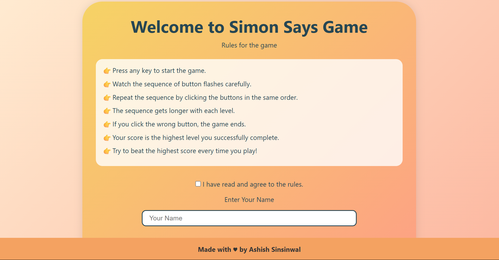
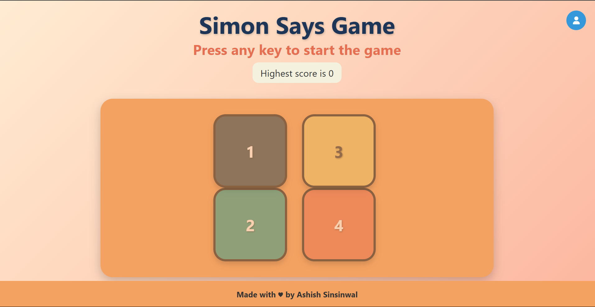

# 🎮 Simon Says Game

A fun and interactive memory game built using **HTML**, **CSS**, and **JavaScript**, inspired by the classic *Simon Says* game. This version includes player login, persistent high scores, and an animated, responsive UI.

## 🚀 Features

- ✅ Interactive gameplay with increasing difficulty.
- 🧠 Memory-based button sequence challenge.
- 🎨 Responsive and colorful UI with smooth animations.
- 👤 Player profile with local storage support.
- 🏆 High score tracking and persistent storage.
- 📱 Mobile responsive design.

## 📸 Preview

  


## 🛠️ Technologies Used

- HTML5
- CSS3
- JavaScript (ES6)

## 📋 How to Play

1. ✅ Read the game rules and check the agreement checkbox.
2. ✍️ Enter your name and click **"Let's Play"**.
3. 🎯 Watch the buttons flash in a sequence.
4. 🧠 Repeat the sequence by clicking the buttons in the same order.
5. 💥 Game ends when you click the wrong button.
6. 🏆 Try to beat your previous high score!

## 📂 Project Structure

📁 simon-says-game/
├── index.html # Main HTML structure
├── app.js # Game logic and interactions
├── simon.css # Styling and responsiveness
└── assets/ # images 


## 💡 LocalStorage Integration

- Stores user name and high score in browser local storage.
- Greets returning users with their previous score.
- Allows multiple users to track their own high scores.

## 📌 To Run Locally

1. Clone the repository or download the zip file.
2. Open the project folder in your code editor.
3. Open `index.html` in your browser.
4. Start playing!

```bash
git clone https://github.com/AshishSinsinwal/SimonSays.git
# Open index.html in your browser

---

Let me know if you'd like this README to include:

- A live demo link (if deployed),
- Screenshots (I can help you structure the assets folder),
- Badges (like GitHub stars, forks, etc.),
- License section.

Just say the word, and I’ll tailor it!
